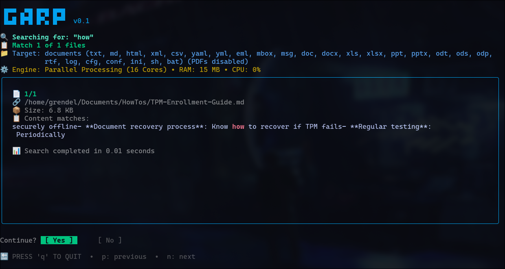

<div align="center">

# :: garp ::


</div>

A high‑performance, pure‑Go document search tool with a clean TUI. garp finds files that contain ALL specified terms within a proximity window and supports many common document formats (including emails, Office files, documents, and PDFs) with pure‑Go extractors.

No relation to the [John Irving novel of the same name](https://en.wikipedia.org/wiki/The_World_According_to_Garp). More like a mispronounced version of "grep" that's easy to remember.



## Quick Usage

```bash
garp contract payment agreement
garp contract payment agreement --distance 200 --not .pdf
garp mutex changed --code
garp bank wire update --not .txt test
garp approval chris gemini --smart-forms
garp report earnings --only pdf
```

ℹ️ Note: PDFs are enabled with strict guardrails (concurrency=2, 250ms per‑PDF, ≤200 pages, ≤128 KiB/page).

## ✨ Key Features

- 🚀 Pure Go: zero external dependencies – just download and run
- ⚡ High-Performance: multi-core parallel processing
- 🎯 Multi-word AND logic (unordered) with a proximity window (default 5000 chars)
- 🧹 Smart content cleaning: strips HTML/CSS/JS, email headers, control chars
- 📄 Binary document support: .eml, .mbox, .pdf, .doc/.docx/.odt, .rtf, .msg (improved); DOC/DOCX/ODT use conservative prefilters
- 📁 Intelligent file filtering; include code files with `--code`
- ❌ Advanced exclusion with `--not` for extensions (e.g., `.txt`) and words
- 💾 Large file handling with safe, size-aware reads
- 🎨 Beautiful TUI with excerpts and highlighting
- 📊 Live progress and per-file status updates

## 🚀 Performance Advantages (vs. typical ripgrep-based pipelines)

- ✅ Zero dependencies – 100% Go implementation
- ✅ Memory optimized for large file sets
- ✅ Parallel processing across CPU cores
- ✅ Cross-platform: Linux, macOS, Windows
- ✅ Content-aware parsing and excerpt extraction

## Highlights

- Pure Go: zero external tools required
- Multi‑word AND search (unordered)
  Proximity window (default: 5000 characters) across the matched terms
- Email/document extraction: EML, MBOX, PDF (guarded), DOC/DOCX/ODT (prefilters), RTF, MSG (improved)
- Smart cleaning: strips HTML/CSS/JS, email headers, control chars, etc.
- Beautiful TUI with live progress, paging, and excerpts
- Optional inclusion of code files

## Install

Option 1: Download the prebuilt binary

- Direct download: https://github.com/CyphrRiot/garp/blob/main/bin/garp
- Example install:
  `curl -L -o ~/.local/bin/garp https://raw.githubusercontent.com/CyphrRiot/garp/main/bin/garp && chmod +x ~/.local/bin/garp`
  (ensure `~/.local/bin` is on your `PATH`)

Option 2: Build and install

```bash
make install
```

This builds the binary to `bin/garp` and copies it to `~/.local/bin/garp`.

Option 2: Use the prebuilt binary in this repo

- The latest binary is kept at `bin/garp`. You can copy that directly to a directory on your `PATH`.

## Quick start

- Basic multi‑word search (unordered within distance window):

    ```bash
    garp contract payment agreement

    ```

- Include code files in the search:

    ```bash
    garp please update --code
    ```

- Exclude words and/or file types:

    ```bash
    garp please wire update --not .txt test demo
    ```

    Notes:
    - Tokens after `--not` are treated as exclusions.
    - Exclusions that start with a dot (e.g., `.txt`, `.pdf`) are treated as file extension excludes.
    - Other tokens are treated as content words to exclude.

## Behavior and UI

Matching is unordered within a distance window (default: 5000 characters). If all terms appear within that window anywhere in the file, the file matches.
During search, the TUI shows: - A header with ASCII "GARP" logo + version, target line listing supported extensions, engine line with live Concurrency: N • Go Heap • Resident • CPU, elapsed time (“Searching” while loading; “Search” after completion), and search terms line - A live progress line: `⏳ Discovery [count/total]: path` or `⏳ Processing [count/total]: path` - A scrolling results box (file details and excerpts) - A non‑scrolling status area above the footer (e.g., “📋 Found N files with matches” and prompts) - Footer with navigation hints

- Navigation keys:
    - Next file: `n`, `y`, `space`, or `enter`
    - Previous file: `p`
    - Quit: `q` (or `Ctrl+C`)

- Layout rules:
    - The header and footer do not scroll.
    - Found/continue status is shown outside the scrolling box (never scrolls off screen).
    - The results box clips instead of overflowing the terminal.

## Supported formats

Document files (default)

- Text: `.txt`, `.md`, `.log`, `.rtf`
- Web: `.html`, `.xml`
- Data/Config: `.csv`, `.yaml`, `.yml`, `.cfg`, `.conf`, `.ini`, `.sh`, `.bat`
- Email: `.eml` (MIME parsing), `.mbox` (collections of messages), `.msg` (raw content)
- Office: `.pdf` (enabled with guardrails), `.doc`, `.docx`
- OpenOffice: `.odt`
- Spreadsheets/Presentations (excluded by default): `.xls`, `.xlsx`, `.ods`, `.ppt`, `.pptx`, `.odp`
  Note: These are excluded by default to keep searches fast and safe. A future opt‑in may add minimal, capped prefilters (e.g., sharedStrings.xml for .xlsx, slide text for .pptx) as outlined in the plan.

Code files (with `--code`)

- `.go`, `.js`, `.ts`, `.py`, `.java`, `.cpp`, `.c`, `.rs`, `.rb`, `.cs`, `.swift`, `.kt`, `.scala`, `.sql`, `.php`, `.json`, and common variants

Binary extraction (pure Go)

- EML: `enmime`
- MBOX: `emersion/go-mbox`
- PDF: `ledongthuc/pdf`
- DOCX/ODT: `archive/zip` + XML parsing
- RTF: regex/control word stripping
- MSG: raw content fallback

## How it works (Pure Go)

- File discovery: walks the directory tree in Go, filtering by known document/code extensions.
- Exclusions:
    - Extensions (tokens after `--not` beginning with a dot) are filtered before content checks.
    - Word exclusions are checked against file content (or extracted text for binary files).
- Matching:
    - Text files: read content (with size limits for large files), then apply unordered, distance‑bounded matching.
    - Binary files: extract text using pure‑Go extractors, then apply the same matching logic.
- Output:
    - Content is cleaned to remove markup, control characters, CSS/JS blocks, and email headers.
    - Excerpts show matched context with basic highlighting.

## Usage summary

Command

```
garp [--code] [--distance N] [--heavy-concurrency N] [--workers N] [--file-timeout-binary N] <word1> <word2> ... [--not <exclude1> <exclude2> ...]
```

Flags

- `--code`: include programming/code files in the search
- `--distance N`: set the proximity window in characters (default 5000)
- `--heavy-concurrency N`: number of concurrent heavy extractions (default 2)
- `--workers N`: number of Stage 2 text filter workers (default 2)
- `--file-timeout-binary N`: timeout in ms for binary file extraction (default 1000)
- `--not`: everything after this is treated as exclusions
    - Exclusions that start with a dot exclude extensions (e.g., `.txt`, `.pdf`)
    - Other exclusions are treated as words to exclude
- `--help`, `-h`: show help
- `--version`, `-v`: show version

Notes

- The proximity window defaults to 5000 characters but can be overridden with --distance N.
- Exclusions apply across the search (not per‑file).

## Building

- `make`: build to `bin/garp`
- `make install`: build and copy to `~/.local/bin/garp`
- `make clean`: remove build artifacts
- `make fmt`, `make test`, `make tidy`: standard dev tasks

We keep the latest binary in `bin/garp` in this repo for convenience so users can download a single file.

## Versioning

- The current version is tracked in the VERSION file (currently `0.5`).
- The `garp` binary reports this version via `--version`.
- Releases should be tagged with the same version, and the README badge updated to match.

## Architecture

```
garp/
├── main.go            # Entry point, calls app.Run()
├── app/
│   ├── cli.go         # Argument parsing, flags, and configuration
│   └── tui.go         # Terminal UI, progress streaming, and results display
├── search/
│   ├── engine.go      # Search orchestration (silent mode for TUI)
│   ├── filter.go      # File walking, matching logic, size-limited reads
│   ├── cleaner.go     # Content cleaning, excerpt extraction, highlighting
│   └── extractor.go   # Pure-Go text extraction for binary formats
├── config/
│   └── types.go       # Supported types, globs/filters, descriptions
├── bin/               # Built binary (kept in-repo for convenience)
├── garp.png           # Screenshot used in README
├── Makefile           # `make install` is your friend
└── README.md
```

## FAQ

- How does multi‑word matching work?
    - Unordered AND within a proximity window (default: 100 characters between the earliest and latest matched terms).
- Can I change the distance?
    - Yes, use --distance N to set the proximity window in characters (default 5000).
- Is it cross‑platform?
    - Yes, the implementation is pure Go and should work on Linux, macOS, and Windows terminals that support ANSI/TUI. You’ll need a compatible terminal for best results.

## Troubleshooting

### pdfcpu: config problem: EOF

The error "pdfcpu: config problem: EOF" in pdfcpu typically occurs when the tool attempts to read its configuration file (usually config.yml located in the pdfcpu configuration directory, such as ~/.config/pdfcpu/ on Linux or %APPDATA%\pdfcpu\ on Windows) but encounters an unexpected end-of-file (EOF). This indicates the file is corrupted, truncated, or incomplete—often due to an interrupted write operation, disk error, or manual editing that left it in an invalid state.

Fix (Linux):

- Clear the corrupted config and retry:

```bash
rm -rf ~/.config/pdfcpu/*
```

- Re-run your garp command; pdfcpu will regenerate default configuration if needed.

## License

MIT
